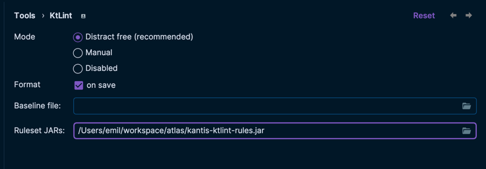

## Getting started

The ruleset contains modified variants of default Ktlint rules. Currently you need to disable the 
following Ktlint rules when using this ruleset:

```editorconfig
[*.{kt,kts}]
ktlint_standard_function-signature = disabled
ktlint_standard_multiline-expression-wrapping = disabled
ktlint_standard_string-template-indent = disabled
```

### IntelliJ plugin / CLI

Download the latest ruleset jar from the release page and put the jar in your repository. The size of the jar is small
enough to be included in version control for distribution.

Then configure the plugin to use the ruleset jar.



### CI/CD pipelines w/ `ktlint-gradle-plugin`

If you don't have the ruleset jar version controlled you can use the ruleset by depending on it's maven artifact.

```kotlin
// ‼️ TODO: Publishing is not yet enabled 
dependencies {
    ktlintRuleset("com.github.kantis:kantis-ktlint-rules:$version")
}
```

If you already have the file in your repository you can use the following snippet.

```kotlin
dependencies {
    ktlintRuleset(files(rootDir.absolutePath + "/path/to/jar"))
}
```